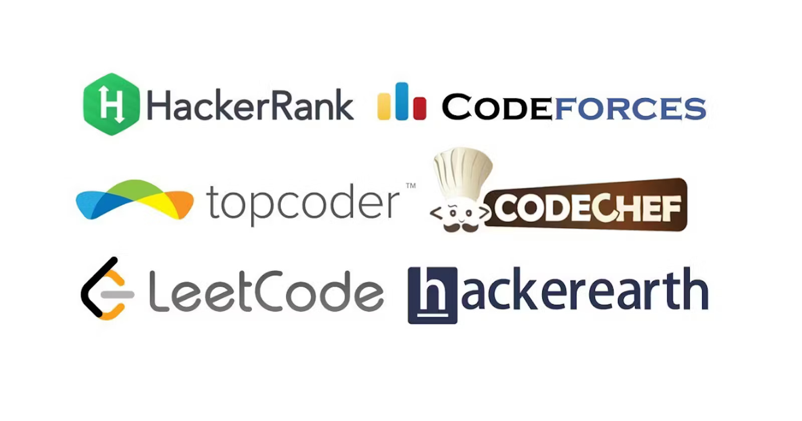

# CodeArchive

Welcome to CodeArchive, your go-to repository for mastering Data Structures and Algorithms (DSA). This GitHub repository is designed to help you hone your programming skills through a curated collection of DSA questions sourced from popular platforms like HackerRank, CodeChef, LeetCode, and more.

## Table of Contents

1. [Introduction](#introduction)
2. [Why CodeArchive?](#why-codearchive)
3. [Top Platform](#top-platform)
4. [How to Use CodeArchive](#how-to-use-codearchive)
5. [Contributing](#contributing)
6. [License](#license)

## Introduction

CodeArchive is a comprehensive collection of DSA problems to aid programmers at all skill levels in enhancing their problem-solving abilities. The world of competitive programming and technical interviews demands proficiency in DSA, and this repository aims to be your one-stop solution for honing these essential skills.

## Why CodeArchive?

### 1. **Diverse Problem Set:**
   CodeArchive houses a wide array of problems categorized by difficulty, topic, and platform. Whether you are a beginner looking to grasp the basics or an advanced coder aiming to fine-tune your skills, you'll find challenges suitable for your level.

### 2. **Platform Integration:**
   We aggregate questions from renowned coding platforms, including HackerRank, CodeChef, LeetCode, and others. This integration ensures that you are exposed to problems representative of different coding styles and challenges from various competitions.

### 3. **Structured Learning Path:**
   The repository is organized systematically, allowing you to follow a structured learning path. Start with the basics and gradually progress to more complex problems. Each category is accompanied by a README file providing insights and tips related to the respective topic.

### 4. **Community-driven Content:**
   CodeArchive thrives on community participation. Users like you contribute to the repository, ensuring a diverse and continually expanding collection. Your contributions help create a vibrant learning ecosystem for everyone involved.

### 5. **Code Solutions:**
   Each problem comes with detailed solutions in popular programming languages. These solutions are not just code snippets; they include explanations and approaches to help you understand the logic behind the solution.

## Top Platform
These are the top platforms from which we have collected the questions.
- [CodeChef](https://www.codechef.com/)
- [Codeforces](https://codeforces.com/)
- [HackerRank](https://www.hackerrank.com/)
- [LeetCode](https://leetcode.com/)
- [hackerearth](https://www.hackerearth.com/)
- [InterviewBit](https://www.interviewbit.com/)
- [GeeksforGeeks](https://www.geeksforgeeks.org/)
- [AtCoder](https://atcoder.jp/)

## How to Use CodeArchive

### 1. **Browsing the Repository:**
   - Navigate through the repository folders to explore problems by difficulty or platform.
   - Each problem folder contains a README file with a brief description and guidelines.

### 2. **Solving Problems:**
   - Choose a problem you find interesting or challenging.
   - Attempt to solve it on your own before referring to the provided solutions.
   - Compare your solution with the ones in the repository and learn from different approaches.

### 3. **Contributing:**
   - Fork the repository.
   - Add new problems or solutions to existing ones.
   - Submit a pull request, and your contribution will be reviewed and merged.

### 4. **Learning Resources:**
   - Check the `Resources` folder for additional learning materials, such as articles, tutorials, and recommended books on DSA.

### 5. **Community Interaction:**
   - Engage with the CodeArchive community through discussions, sharing your insights, or seeking help on specific problems.

## Contributing

CodeArchive welcomes contributions from the programming community. Whether you want to add new problems, improve existing solutions, or enhance documentation, your efforts are valuable. Follow these steps to contribute:

1. Fork the repository to your GitHub account.
2. Clone the forked repository to your local machine.
3. Create a new branch for your changes (`git checkout -b feature/your-feature`).
4. Make your changes and commit them (`git commit -m 'Add your feature'`).
5. Push the changes to your forked repository (`git push origin feature/your-feature`).
6. Create a pull request to the main CodeArchive repository.

Please adhere to the repository's contribution guidelines, and your contributions will be reviewed promptly.

## License

CodeArchive is licensed under the MIT License - see the [LICENSE](LICENSE) file for details.

---

Happy coding and best of luck on your journey to mastering Data Structures and Algorithms with CodeArchive! If you have any questions or suggestions, feel free to reach out to the community.